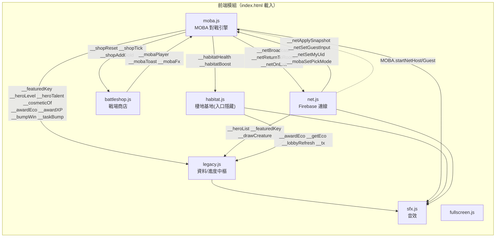
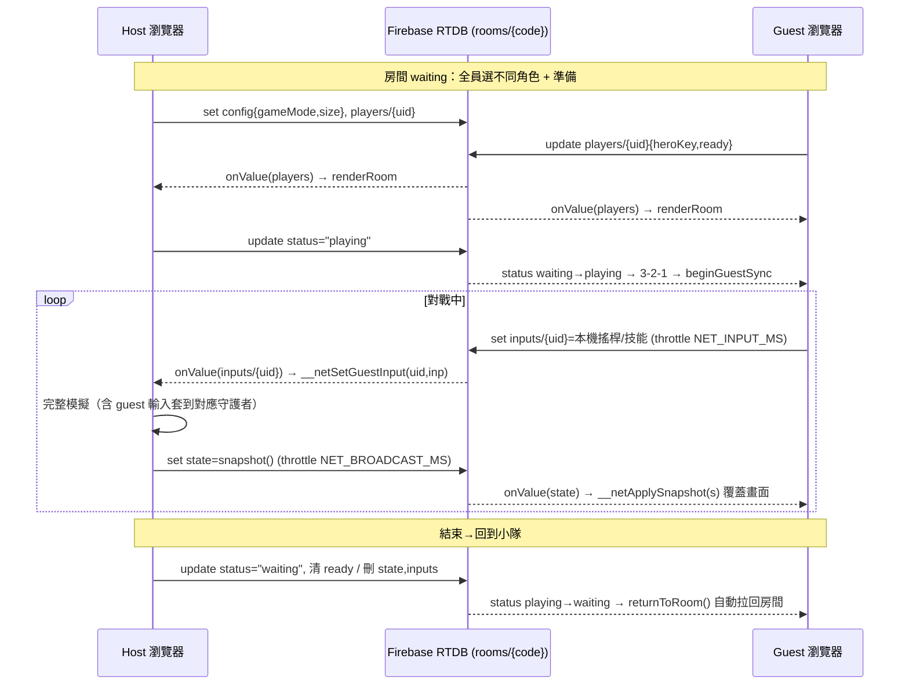
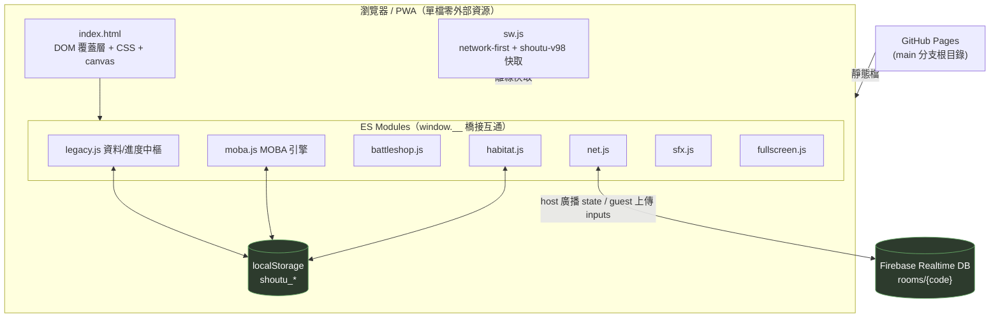

# 守土 · 福爾摩沙衛士 — 架構文件（ARCHITECTURE）

> 對應版本：**Beta 1.0**（commit `8c53e28` / Service Worker `shoutu-v98`）。
> 本檔說明「整體架構」；系統細節（等級/成長、對戰）見 **`docs/SYSTEMS.md`**；協作流程見 **`docs/PROCESS.md`**；願景與鐵則見 `CLAUDE.md` 與 `docs/SPEC.md`。

---

## 0. 一頁總覽

- **前端**：單一 `index.html`（外殼、CSS、所有 DOM 覆蓋層）＋ 7 個 ES module（`src/*.js`）。全部靜態，無打包（`<script type="module">` 直接載入）。
- **模組互通**：模組之間**只透過 `window.__xxx` 全域橋接**溝通，不互相 `import`。這是本專案最重要的架構約定 —— 每個模組是自成一體的 IIFE / module，對外只暴露/呼叫 `window.__` 介面。
- **後端**：Firebase Realtime Database（好友連線用），host-authoritative 快照同步。單機模式完全不需要後端。
- **儲存**：全部 `localStorage`（鍵名前綴 `shoutu_`）。無雲端存檔。
- **部署**：GitHub Pages，從 `main` 分支根目錄服務靜態檔；PWA（`sw.js` network-first + 版本化快取）。

---

## 1. 前端模組結構

`index.html` 依固定順序載入 7 個模組（順序重要：`legacy.js` 先掛上多數 `window.__` 橋接，其他模組才能取用）：

```
<script type="module" src="./src/fullscreen.js"></script>   1. 全螢幕
<script type="module" src="./src/sfx.js"></script>          2. 音效（先掛 __sfx，供所有人用）
<script type="module" src="./src/legacy.js"></script>       3. 大廳＋舊 1v1＋資料中樞（掛最多橋接）
<script type="module" src="./src/moba.js"></script>         4. 俯視角 MOBA 對戰引擎
<script type="module" src="./src/battleshop.js"></script>   5. 戰場商店（掛在 moba 之後、讀 __moba*）
<script type="module" src="./src/net.js"></script>          6. Firebase 好友連線
<script type="module" src="./src/habitat.js"></script>      7. 棲地基地（入口目前隱藏）
```

### 各模組職責

| 模組 | 職責 | 對外暴露（`window.__`） | 主要取用（呼叫別人） |
|---|---|---|---|
| **fullscreen.js** | 全螢幕切換按鈕 | `__fs` | — |
| **sfx.js** | 純程序化 Web Audio 音效（零外部檔）、靜音開關 | `__sfx` | `localStorage("shoutu_muted")` |
| **legacy.js** | **資料 / 進度中樞**：大廳 UI、選角、服裝店、通行證、每日任務、圖鑑、舊 1v1 戰役、`HEROES/CH/TYPE/ADV/eff`、`drawCreature`、守護者等級 XP、天賦樹、保育值 | `__drawCreature` `__heroList` `__unlockedKeys` `__featuredKey` `__cosmeticOf` `__heroLevel` `__heroTalent` `__awardEco` `__getEco` `__conservationLevel` `__awardXP` `__bumpWin` `__taskBump` `__lobbyRefresh` `__tx` | `__sfx` |
| **moba.js** | **俯視角 MOBA 對戰引擎**：4 種模式、神木/苗圃/AI、首領挑戰難度晉級、打擊感、netcode 快照序列化/還原 | `__mobaSetPickMode` `__mobaPlayer` `__mobaToast` `__mobaFx` `__netApplySnapshot` `__netSetMyUid` `__netSetGuestInput` `__netLocalInput` `__netCheckStale` | `__featuredKey` `__heroLevel` `__heroTalent` `__cosmeticOf` `__awardEco` `__awardXP` `__bumpWin` `__taskBump` `__habitatHealth` `__habitatBoost` `__lobbyRefresh` `__netBroadcast` `__netReturnToRoom` `__netOnExit` `__shop*` `__sfx` |
| **battleshop.js** | 戰場商店：金幣買戰場強化 | `__shopReset` `__shopTick` `__shopAddGold` | `__mobaPlayer` `__mobaToast` `__mobaFx` `__sfx` |
| **net.js** | Firebase 好友連線：房間 CRUD、host/guest 同步橋接、倒數、回到小隊 | `__fb` `__netBroadcast` `__netHostKeyOverride` `__netReturnToRoom` `__netOnExit` `__netDebugRoom` `__mobaSetPickMode`（呼叫） | `__heroList` `__featuredKey` `__drawCreature` `__netSetMyUid` `__netApplySnapshot` `__netSetGuestInput` `__netLocalInput` `__sfx` `MOBA.*` |
| **habitat.js** | 棲地基地：種植物、離線成長、訪客、生態走廊、保育站 10 關（**大廳入口目前隱藏**） | `__habitatHealth` `__habitatBoost` `__conservationLevel`（自算） `__habitat*`（除錯） | `__awardEco` `__getEco` `__habitatHealth` `__sfx` `__tx` `__lobbyRefresh` |

### 橋接關係圖（模組 ⇄ 模組）



> **核心原則**：`legacy.js` 是「唯一存進度的地方」（保育值、XP、解鎖、服裝、任務、通行證都在它手上）。`moba.js` 打完一場，只是呼叫 `__awardEco / __awardXP / __bumpWin / __taskBump` 把結果「回報」給中樞，不自己碰那些 `localStorage` 鍵。例外：`moba.js` 自己管的是「對戰模式相關」的鍵（`shoutu_duel_level` / `shoutu_pve_level` / `shoutu_besttime_*` / `shoutu_duel_best`）。

---

## 2. 後端架構（Firebase Realtime Database）

只有「好友連線」用到後端。採 **host-authoritative** 模型：**房主（host）在自己機器上跑完整模擬並廣播快照，其他人（guest）只上傳輸入、接收快照後照著畫**。

### 2.1 `rooms/{code}` schema

```
rooms/
  {ROOMCODE}/                房間代碼（大寫英數，邀請碼）
    host:      <uid>         房主 uid
    mode:      "invite"      房型（保留給未來 quickmatch 配對）
    status:    "waiting" | "playing"
    createdAt / updatedAt: <ms>
    config:                  房主可改
      gameMode: "duel" | "normal" | "time" | "pve"   對戰模式
      size:     1..5          隊伍人數
    players/
      {uid}/
        nick:    <string>     暱稱
        host:    <bool>
        heroKey: <string>     選的守護者 key（全房不可重複）
        ready:   <bool>
        joinedAt:<ms>
    state:  <snapshot>        host 每 NET_BROADCAST_MS 覆寫一次（見 §2.3）
    inputs/
      {uid}:  {mvx,mvy,sp,back,atk,ult}   guest 每 NET_INPUT_MS 覆寫自己那筆
```

### 2.2 同步流程



- **guest 認出自己那隻**：`net.js` 登入後 `__netSetMyUid(uid)`；快照中每隻 hero 帶 `ctrl` 欄位（= 操控者 uid），guest 端 `applySnapshot` 用 `ctrl===netMyUid` 找到自己的守護者當鏡頭焦點（不是抓 host 的 `isPlayer`）。
- **離線韌性**：guest 端 `__netCheckStale` 偵測快照超時（`NET_TIMEOUT_MS`）→ 顯示連線不穩。host 離開＝刪整個 `rooms/{code}`（guest 收到 `!data` 顯示「房間已解散」）；guest 離開＝只刪自己的 `players/{uid}`。
- **沙盒限制**：CI/無頭環境連不到 Firebase，好友連線需**真機測**；`__netDebugRoom` 可餵假資料驗 UI。

### 2.3 快照（snapshot）欄位

見 `docs/SYSTEMS.md §對戰系統 · netcode 快照`。要點：只送「重建畫面的最小欄位」（hp/位置/朝向/死活/首領資訊），**不送 fx/floats 等純特效**，guest 端靠 hp/位置變化自行觸發本地特效。

---

## 3. 資料 / 儲存 —— localStorage 鍵名一覽

所有存檔都在 `localStorage`，前綴 `shoutu_`。下表已逐一 grep 確認（含所屬模組與語意）。

| 鍵名 | 型別 | 語意 | 主要負責模組 |
|---|---|---|---|
| `shoutu_unlocked` | int | 舊 1v1 戰役過關進度（章節數）。**不可改名**（鐵則） | legacy.js |
| `shoutu_eco` | int | **目前**保育值（可花費，買服裝/天賦會扣） | legacy.js / habitat.js |
| `shoutu_ecoearned` | int | **累積**保育值（終身只增不減；保育等級用這個算，才不會退等） | legacy.js / habitat.js |
| `shoutu_xp` | JSON `{key:xp}` | 每隻守護者累積經驗值（上限 4999，對應 Lv50） | legacy.js |
| `shoutu_talents` | JSON `{key:{path,tier}}` | 每隻守護者天賦樹選線與階級 | legacy.js |
| `shoutu_heroes` | JSON `[key,...]` | 已用保育值解鎖的守護者清單 | legacy.js |
| `shoutu_wins` | int | 累計對戰勝場 | legacy.js（moba 透過 `__bumpWin`） |
| `shoutu_maxstar` | int | 舊 1v1 最高星級 | legacy.js |
| `shoutu_pass_pts` | int | 🎟 通行證點數（每日任務領取累積） | legacy.js |
| `shoutu_daily` | JSON `{date,prog,claimed}` | 每日任務進度（每天刷新） | legacy.js |
| `shoutu_cosmetics` | JSON `[key,...]` | 已擁有的服裝（含保育值服裝＋通行證服裝） | legacy.js |
| `shoutu_cos_<heroKey>` | string | 某守護者目前裝備的服裝 key（每隻各記一筆） | legacy.js |
| `shoutu_nick` | string | 玩家暱稱（連線/紀錄用） | net.js / moba.js |
| `shoutu_muted` | "0"/"1" | 音效靜音開關 | sfx.js |
| `shoutu_duel_level` | int(1..5) | 首領挑戰難度等級（見習→…→大師，全域共用） | moba.js |
| `shoutu_duel_best` | JSON `{size:{time,name}}` | 首領挑戰各人數(1~5)最佳通關時間＋名字 | moba.js |
| `shoutu_pve_level` | JSON `{target:level}` | 外來種防衛戰(PVE)每個目標各自關卡進度 | moba.js |
| `shoutu_besttime_<size>` | float | 限時挑戰各人數最佳完成時間 | moba.js |
| `shoutu_habitat_v2` | JSON | 棲地基地各區種植/成長狀態（v2 存檔） | habitat.js |
| `shoutu_corridors` | JSON | 已建立的生態走廊 | habitat.js |
| `shoutu_conservation_stage` | int | 保育站關卡進度（10 關） | habitat.js |
| `shoutu_conservation_title` | string | 保育站頭銜 | habitat.js |
| `shoutu_visitor_log` | JSON `[id,...]` | 已見過的野生動物訪客圖鑑 | habitat.js |

> **鐵則提醒**：`shoutu_unlocked` 不可改名（`CLAUDE.md §鐵則`）。其餘鍵可擴充但**不可改壞既有讀寫語意**，改動需同步本表。

---

## 4. 系統架構全景圖



### 部署管線

- 開發分支：`claude/dinosaur-game-infinite-levels-kpfmbm`；部署分支：`main`。
- 每次完成把同一 commit push 到**開發分支與 `main`**，Pages 1–2 分鐘自動更新。
- PWA：改任何 `src/*.js` / `index.html` / `manifest.json` 需**同步更新 `sw.js` 的 `ASSETS` 並提升 `CACHE` 版本號**（目前 `shoutu-v98`）。sw 為 network-first，升版即生效、可安全回退。

---

## 5. 給協作 agent 的閱讀順序

1. `CLAUDE.md`（宗旨 + 鐵則，動程式前必讀）
2. 本檔（架構全景 + 橋接 + 存檔）
3. `docs/SYSTEMS.md`（等級/成長、對戰兩大系統的公式與鍵名）
4. `docs/PROCESS.md`（「對談→需求單」協作合約）
5. `docs/SPEC.md`（完整規格 + 決策紀錄）、`docs/SIEGE-MODE.md`（待做模式）

---

## 6. Planned shared Web/mobile topology（2026-08-29，尚未實作）

### 6.1 目標

保留單一 `jimmyliao/maxgame` repo 與一份 gameplay/content truth：

```text
shared TypeScript game core + Canvas renderer + content/assets
                   |
          +--------+--------+
          |                 |
     Web/PWA shell     Capacitor mobile shell
     GitHub Pages      offline bundled dist
                            |
                  iOS / Android adapters
             haptics · lifecycle · share · safe area
```

Capacitor 只負責平台 shell；`src` 中的規則、場景、renderer、content 與本機進度邏輯仍是單一正本。Mobile 不能在 runtime 載入 production 網站，也不能以 remote code 繞過 Store review。

### 6.2 漸進式目錄方向

```text
src/
  core/       # deterministic rules/state/content contracts
  render/     # Canvas2D rendering/VFX
  scenes/     # lobby/battle/result/dex/habitat
  platform/   # web.ts / capacitor.ts adapters
  net/        # Firebase multiplayer; Web only, excluded Store v1
public/assets/
capacitor.config.ts
ios/          # generated native shell; signing human-owned
android/      # generated native shell; signing human-owned
```

不為符合此圖一次性重寫。先從現行 `window.__*` 橋接抽出可測試 contract，再逐模組搬移；每一步保持 Web 行為與既有 `shoutu_*` 本機進度相容。`shoutu_unlocked` 等既有鍵不改名。

### 6.3 Platform adapter boundary

Game core 只能依賴窄介面：storage、haptics、share、orientation、lifecycle、clock/audio。Web adapter 使用 localStorage/Web APIs；Capacitor adapter 使用官方 plugin。Firebase multiplayer 是 optional Web capability，Store v1 不載入。

### 6.4 CI/release lanes

| Lane | Trigger | Output | Gate |
|---|---|---|---|
| PR | `discord/max/*` 或一般 PR | typecheck/unit/build/smoke + desktop/mobile screenshots | Max/Jimmy approve |
| Web production | merge `main` | legacy Pages（遷移期）或後續 Actions `dist/` | CI green + human merge |
| Mobile candidate | explicit release tag | offline iOS/Android build | human-owned signing + device smoke |
| Store release | manual | ASC/Play submission | Jimmy explicit go；never bot-triggered |

### 6.5 Current gap and residual risks

- `openab-max-agy` 尚未 mount 此 repo；現行 JimiOMP 能聊天/存取較廣，不是 child-safe writer。
- 現行模組以 `window.__*` 緊耦合；shared core 抽取需逐步 contract tests，不能 big-bang rewrite。
- GitHub Pages 目前直接服務 `main` root，不是 Vite `dist/`；切 Actions deployment 是最後門，不與 mobile scaffold 同時進行。
- Store App 的內容/素材 provenance、age rating、privacy、offline size、background/lifecycle 行為尚未驗證。
