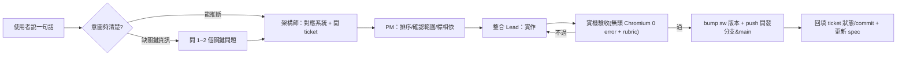

# 守土 · 福爾摩沙衛士 — 協作合約：對談 → 需求單（PROCESS）

> 目的：讓「使用者說一句話」能**穩定地**變成可實作、可驗收、可回溯的**需求單（ticket）**，跨 session / 跨 agent 都對齊，不掉資訊、不重工。
> 對應版本：**Beta 1.0**（commit `8c53e28` / `shoutu-v98`）。搭配 `docs/ARCHITECTURE.md`、`docs/SYSTEMS.md` 使用。

---

## 1. 角色（agent team）

| 角色 | 職責 | 交棒 |
|---|---|---|
| **整合 Lead（主 Claude）** | 統籌全局、實作、實機驗收、部署、維護 spec。是唯一動程式碼、跑無頭測試、push 的人。 | 收 PM 排好序的 ticket → 實作 → 驗收 → 部署 → 回填 ticket 狀態與 commit |
| **架構師 agent** | 把使用者需求對應到系統（等級/對戰/棲地/連線…），評估對鐵則與資料合約的影響，寫成需求單草稿。**只寫 .md，不改程式。** | 產出 ticket 草稿（對應系統 + 驗收條件）交 PM |
| **PM agent** | 排序、確認範圍、控管 backlog、標記優先級與相依。判斷「這句話要不要先問清楚」。 | 把排好的 ticket 交整合 Lead |
| **在地化 agent** | 把握台灣用語、生態保育正確性、圖鑑知識、正體中文文案品質。 | 審 ticket 中的文案/知識、審成品用語 |

> 既有的美術/引擎團隊分工見 `CLAUDE.md §團隊分工`；本檔補的是「**需求怎麼進來**」這一段。

---

## 2. 流程：使用者一句話 → 上線



### 關鍵原則

1. **快速釐清意圖，能推斷就別問**：最多問 **1~2 個關鍵問題**（會影響方向或驗收的那種）。細節能從既有系統/宗旨推斷的，直接推斷、寫進 ticket 的「意圖釐清」欄，讓使用者一眼確認即可。
   - 該問的例子：「攻守對決的情報道具要哪些品項？」（無此資訊做不完核心循環）。
   - 不用問的例子：「打贏要不要給保育值？」（宗旨與既有公式已定，直接沿用）。
2. **每個需求都對應到系統**：進 ticket 時標明落在 `等級/成長`、`對戰`、`棲地`、`連線`、`大廳/UI`、`美術/打擊感`、`PWA/部署` 哪一塊，方便查鐵則與資料合約影響。
3. **驗收條件先寫**：ticket 建立時就寫好「怎樣算完成」（含一票否決項：`node --check` 過、無頭 0 error、粒子上限+回收、單檔零外部資源）。
4. **完成就回填**：實作+部署後，回填 ticket 狀態、對應 commit、sw 版本，並更新 `CLAUDE.md §目前狀態` 與 `docs/SPEC.md §決策紀錄`。

---

## 3. 需求單模板（輕量）

複製下列區塊到 §4 backlog 新增一筆：

```md
### T-000 標題
- **使用者原話**：「……」
- **意圖釐清**：（架構師推斷的真正想要，+ 問過的 1~2 個問題與答案）
- **對應系統**：等級/成長 | 對戰 | 棲地 | 連線 | 大廳/UI | 美術/打擊感 | PWA/部署
- **驗收條件**：
  - [ ] （具體可測，含相關鐵則/資料合約不被改壞的檢查）
- **狀態**：待辦 | 進行中 | 待驗收 | 已完成 | 擱置
- **對應 commit / 版本**：`xxxxxxx` / sw vNN
```

> 欄位固定：**編號、標題、使用者原話、意圖釐清、對應系統、驗收條件、狀態、對應 commit/版本**。

---

## 4. 需求單記錄（Backlog）

回顧目前對話已完成的需求，補成 ticket（皆標「已完成」，並註記對應 sw 版本區間 v91~v98 / Beta 1.0 `8c53e28`）。

### T-001 對戰完回到小隊
- **使用者原話**：（好友連線）對戰打完要能回到同一個房間再決定續戰或離開。
- **意圖釐清**：不解散房間；房主轉 `waiting`、清 ready、刪上一場 state/inputs；guest 端偵測 `playing→waiting` 自動被拉回。
- **對應系統**：連線
- **驗收條件**：[x] 結算鈕變「↩ 回到小隊」　[x] guest 自動回房　[x] 房間狀態正確重置
- **狀態**：已完成
- **對應 commit / 版本**：Beta 1.0 `8c53e28` / sw ~v94（`__netReturnToRoom`）

### T-002 首領難度晉級到大師
- **使用者原話**：首領挑戰要有難度遞增，打贏越來越難。
- **意圖釐清**：見習→初階→中階→高階→大師 5 級（`shoutu_duel_level`，全域共用）；打贏 +1、輸不降；首領隨「難度 × 人數」變強；記各人數最佳通關（`shoutu_duel_best`）。
- **對應系統**：對戰 / 等級成長
- **驗收條件**：[x] 晉級/封頂文案　[x] 首領數值隨等級縮放　[x] 離線保存
- **狀態**：已完成
- **對應 commit / 版本**：Beta 1.0 `8c53e28` / sw ~v95

### T-003 預設解鎖 5 隻守護者
- **使用者原話**：好友房要能 5 個人各選不同角色。
- **意圖釐清**：預設解鎖石虎/黑熊/爺蟬/勾蜓/梅花鹿，足夠 5 位真人各選不同；其餘用保育值解鎖。
- **對應系統**：等級成長 / 連線
- **驗收條件**：[x] 5 隻預設可選　[x] 連線選角不可重複
- **狀態**：已完成
- **對應 commit / 版本**：Beta 1.0 `8c53e28`

### T-004 打擊感 / 電影運鏡（大作感）
- **使用者原話**：要有大作的打擊感。
- **意圖釐清**：命中定格 hit-stop（重擊/必殺/首領震波/擊破）、首領登場電影運鏡（letterbox+名號大字+紅色掃光+威壓音效）、擊破三層衝擊環大爆發。粒子須有硬上限+回收。
- **對應系統**：美術/打擊感 | 對戰
- **驗收條件**：[x] hit-stop 生效　[x] 首領登場運鏡　[x] 粒子上限+回收（一票否決）
- **狀態**：已完成
- **對應 commit / 版本**：Beta 1.0 `8c53e28` / sw ~v96

### T-005 通行證系統
- **使用者原話**：每日任務簡化，完成給獎勵能換特別的東西。
- **意圖釐清**：每日任務精簡成 3 個（打贏/賺 150 保育值/擊敗大首領），完成領 🎟 通行證點數（票券飛入徽章動畫）；用點數兌換 4 款專屬華麗服裝。
- **對應系統**：等級成長 | 大廳/UI
- **驗收條件**：[x] 3 任務+跨日刷新　[x] `shoutu_pass_pts` 收支　[x] 4 款服裝大廳+戰場可見
- **狀態**：已完成
- **對應 commit / 版本**：Beta 1.0 `8c53e28` / sw ~v97

### T-006 首領挑戰陣亡不復活 + 觀戰
- **使用者原話**：首領挑戰死了不要能一直復活。
- **意圖釐清**：首領挑戰隱藏回神木補血；死＝陣亡不復活；陣亡後鏡頭切到存活隊友觀戰（HUD 顯示）；全員陣亡即敗。
- **對應系統**：對戰
- **驗收條件**：[x] 補血鈕隱藏　[x] 觀戰鏡頭切換　[x] 全員陣亡判敗
- **狀態**：已完成
- **對應 commit / 版本**：Beta 1.0 `8c53e28`

### T-007 對戰節奏調快
- **使用者原話**：對戰節奏可以再快一點。
- **意圖釐清**：整體對戰步調加快（推進/生成/獎勵回饋），維持 3–5 分鐘體感。
- **對應系統**：對戰
- **驗收條件**：[x] 節奏加快　[x] 無頭 0 error
- **狀態**：已完成
- **對應 commit / 版本**：Beta 1.0 `8c53e28`

### T-008 移除棲地入口
- **使用者原話**：先把棲地基地入口從大廳拿掉。
- **意圖釐清**：暫時隱藏大廳的棲地入口（程式保留、`habitat.js` 不刪），聚焦對戰體驗；未來可再開。
- **對應系統**：大廳/UI | 棲地
- **驗收條件**：[x] 大廳無棲地入口　[x] habitat.js 程式保留可回復
- **狀態**：已完成
- **對應 commit / 版本**：Beta 1.0 `8c53e28` / sw v98

### T-009 攻守對決模式（Siege）— 待做
- **使用者原話**：想做攻守對決、用錢買情報道具互相試探。
- **意圖釐清**：1v1~5v5、攻/守、三戰兩勝攻守互換、戰場迷霧+情報道具。**卡在「情報道具品項待使用者定案」才能完成核心循環**（見 `docs/SIEGE-MODE.md`）。
- **對應系統**：對戰
- **驗收條件**：[ ] 道具品項定案　[ ] 回合狀態機　[ ] 迷霧+情報道具　[ ] 第一版打 AI
- **狀態**：擱置（等使用者定道具）
- **對應 commit / 版本**：—

---

## 5. 維護

- 新需求進來 → 架構師依 §3 模板在 §4 新增 ticket（編號遞增）→ PM 排序 → 整合 Lead 實作驗收部署 → 回填。
- 每完成一批，同步更新 `CLAUDE.md §目前狀態`、`docs/SPEC.md §決策紀錄`、必要時更新 `docs/ARCHITECTURE.md` / `docs/SYSTEMS.md`。
