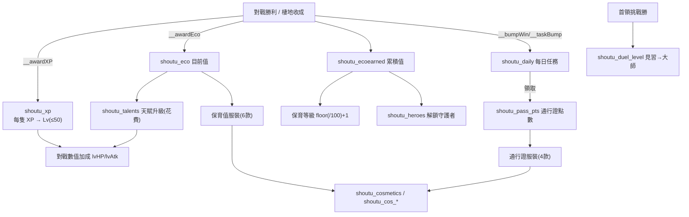
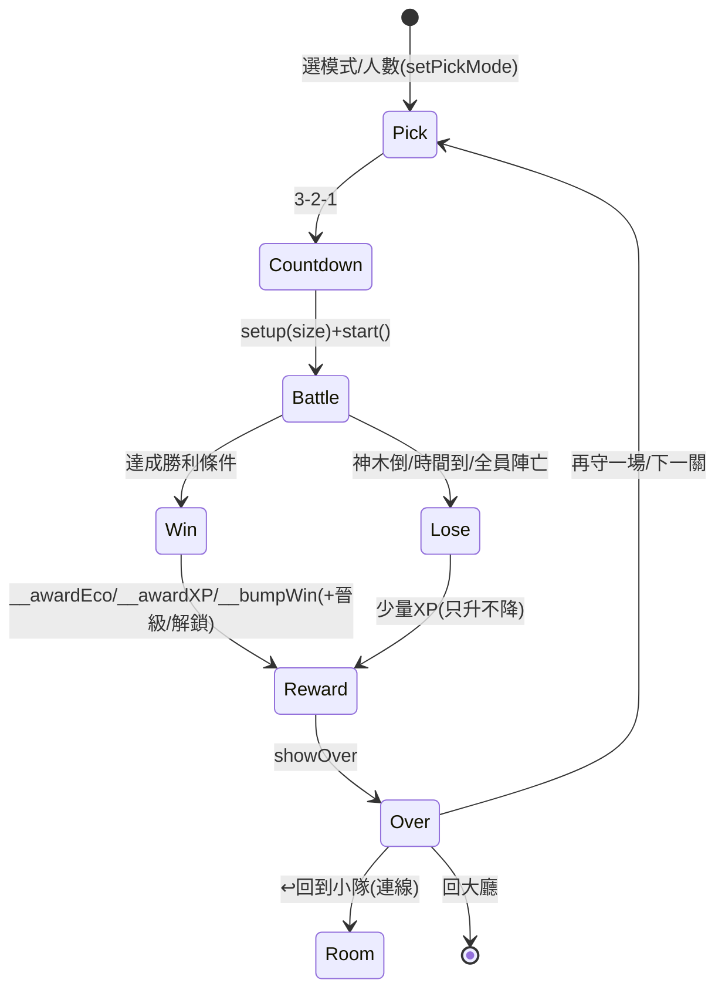

# 守土 · 福爾摩沙衛士 — 系統詳規（SYSTEMS）

> 對應版本：**Beta 1.0**（commit `8c53e28` / `shoutu-v98`）。
> 本檔詳述兩大系統：**等級 / 成長系統**與**對戰系統**。架構與橋接見 `docs/ARCHITECTURE.md`。所有公式與 localStorage 鍵名以現行程式為準（`src/legacy.js`、`src/moba.js`）。

---

## A. 等級 / 成長系統

玩家的「變強」由多條互不干擾的進度軸組成，各自有獨立鍵名與公式。

### A.1 守護者等級與經驗值（XP）

- 存檔：`shoutu_xp` = JSON `{heroKey: xp}`（每隻獨立累積）。
- 公式（`src/legacy.js`）：
  - `heroLevel(key) = min(50, floor(heroXP/100) + 1)` → **每 100 XP 升 1 級，最高 Lv50**。
  - `gainXP(key,amt)`：`xp = min(xp+amt, 4999)`（4999 對應 Lv50 封頂）。
  - **等級只升不降**（輸了也給少量 XP）。
- 等級加成（帶進 MOBA 對戰）：
  - `lvHP(key) = 100 + (level-1)*6`（每級 +6 血）。
  - `lvAtk(key) = floor((level-1)/4)`（每 4 級 +1 攻擊）。
- XP 來源（`moba.js` endGame 系列，透過 `__awardXP`）：
  - 一般復育戰勝：`xp = 60 + teamSize*10 + killCount`
  - PVE 防衛戰勝：`xp = 50 + teamSize*8 + got*2 + level*3`
  - 首領挑戰勝：`xp = 70 + size*8 + duelLevel*6`
  - 各模式敗場也給少量 XP（8~12+），確保只升不降。
- 橋接：`__heroLevel(key)`（唯讀等級）、`__awardXP(key,n)`。

### A.2 天賦樹（分歧培養）

- 存檔：`shoutu_talents` = JSON `{heroKey:{path,tier}}`。
- 結構：每隻守護者 **2 條路線二選一（A/B）**，各 **3 級**；已選路線需升到底才能重選（避免混搭）。
- 升級花費「目前保育值 `shoutu_eco`」：三級 cost 依角色約 `60 / 120 / 240`。
- 加成欄位疊加：`dmg`（攻擊倍率）、`speed`（速度倍率）、`spCd`（技能冷卻倍率，負值＝更快）、`dr`（減傷 0~1）。
- **第 3 級解鎖主動技能旗標** `active.effect`（如 `leopard_ambush`），由 `moba.js castSp()` 讀取觸發專屬強化。
- 橋接：`__heroTalent(key)` 回傳 `{path,pathName,tier,mods:{dmg,speed,spCd,dr},active}|null`，供 MOBA 讀取套用。

### A.3 保育值與保育等級

- **兩個鍵分工**：
  - `shoutu_eco` = **目前**保育值（可花費：買服裝、升天賦會扣）。
  - `shoutu_ecoearned` = **累積**保育值（終身只增不減）。
- **保育等級公式**：`conservationLevel = floor(ecoEarned/100) + 1`（用累積值算，花費不會退等）。
- 橋接：`__getEco()`、`__awardEco(n)`（同時推進每日「賺保育值」任務）、`__conservationLevel()`。
- 保育值來源：對戰勝利（各模式 `eco` 公式，見 §B.4）、棲地基地收成（habitat.js）。

### A.4 首領挑戰難度晉級（見習→大師）

- 存檔：`shoutu_duel_level`（int 1~5，全域共用一個進度、離線保存）。
- 階級：`DUEL_TIERS = ["見習","初階","中階","高階","大師"]`。
- **晉級規則**：首領挑戰**打贏就 +1 級**（封頂大師）；輸了難度不變、可再挑戰。
- 首領強度 = **難度等級 × 挑戰人數**共同放大（`level*8` 進獎勵、boss 血量/傷害隨兩者上升）。
- 通關紀錄：`shoutu_duel_best` = JSON `{size:{time,name}}`，各人數(1~5)各記一筆最佳時間＋玩家名字。

### A.5 守護者解鎖（locked / cost）

- 基本 5 隻**預設解鎖**（石虎/黑熊/爺蟬/勾蜓/梅花鹿），足夠 5 位真人各選不同。
- 其餘為 `locked`，用**累積保育值**解鎖，清單存 `shoutu_heroes`（JSON 陣列）。
- 判定：`isHeroUnlocked(key)` — 非 locked 恆解鎖，locked 者需在 `shoutu_heroes` 內。
- 橋接：`__unlockedKeys()`、`__heroList()`（給連線選角的唯讀清單，不含鎖定角色）。

### A.6 通行證點數（Pass Points）

- 存檔：`shoutu_pass_pts`（int）。
- 來源：完成**每日任務**（精簡成 3 個）領取：
  - `win` 打贏 1 場對戰 → 🎟 3　·　`eco` 賺 150 保育值 → 🎟 2　·　`boss` 擊敗 1 位大首領 → 🎟 4
  - 每日進度存 `shoutu_daily` = `{date,prog,claimed}`（跨日自動刷新）。
  - 任務進度由 `__bumpWin` / `__awardEco` / `__taskBump("boss")` 驅動。
- 用途：`🎟 通行證`(navPass) 兌換 **4 款專屬特殊服裝**（神聖光輪🎟8 / 聖焰之環🎟12 / 極光之翼🎟16 / 鳳凰之羽🎟22），大廳＋戰場皆可見。

### A.7 服裝（Cosmetics）

- 兩條來源：**保育值服裝店**（用 `shoutu_eco` 買，6 款）＋**通行證服裝**（用 `shoutu_pass_pts` 兌，4 款）。
- 存檔：`shoutu_cosmetics`（已擁有 JSON 陣列，兩來源共用）；`shoutu_cos_<heroKey>`（每隻各記目前裝備）。
- 純程序繪製 `drawCosmetic()`（無外部資源、無粒子洩漏）；戰場透過 `__cosmeticOf(key)` 讀取讓裝飾也顯示。

### 成長系統關係圖

---

## B. 對戰系統（俯視角 MOBA · `src/moba.js`）

### B.1 四種模式

`pickMode` 決定，`setPickMode(m)` 切換（連線由 `__mobaSetPickMode`）：

| 模式 | pickMode | 勝利條件 | 敗北條件 | 專屬機制 |
|---|---|---|---|---|
| **一般復育戰** | `normal` | 復原度 `restore>=1`（守好苗圃、驅逐入侵種） | 神木倒下 | 隨時可回神木補血；波次入侵 |
| **限時挑戰** | `time` | 同一般復育戰，但記錄完成時間 | 神木倒下 | `shoutu_besttime_<size>` 最佳時間 |
| **外來種防衛戰(PVE)** | `pve` | 限時內清除足量指定入侵種（`got>=need`） | 時間到未達標 / 神木倒 | 關卡遞增：過關 `shoutu_pve_level` +1，need↑時限↓敵更強 |
| **首領挑戰** | `duel` | 擊敗超強首領 | 時限到 / 神木倒 / **全員陣亡** | 難度晉級、**陣亡不復活+觀戰**（見 §B.5） |

- 四模式開場皆有 **3-2-1 倒數**（單機 `mCountdown`，連線走 net.js 倒數）。
- PVE 參數（`pveLevelParams`）：第 1 關基準，每關 `need+3`、`時限-6秒(下限40)`、血量 `×(1+0.22·step)`、傷害 `×(1+0.12·step)`、生成 `×(1+0.18·step)`。

### B.2 核心戰鬥

- **普攻**：近戰命中判定（`meleeHit`），有攻擊間隔 `cd`。
- **技能（守護之力 / 專屬技能）**：`castSp()`，冷卻 `spCd`；天賦第 3 級解鎖 `active.effect` 強化。
- **撿拾式必殺**：場上生成 relic（守護之力），撿到才能放大招（`tryPickRelic`）。
- **連擊（combo）**：連續命中累積，結算顯示 `comboBest`（≥3 顯示）。
- **屬性相剋**（原創，台灣棲地）：`forest 🌲 / water 💧 / sky 🌪 / bug 🪲`，環 **🌲>💧>🌪>🪲>🌲**；`eff(at,df)`：剋制 ×1.6 / 被剋 ×0.6 / 其他 ×1。**鐵則：鍵名與相剋環不可動**。
- **入侵種行為**：一般波次 AI；蓄力衝撞；精英/首領放大數值。
- **打擊感（hit-stop）**：命中定格凍結（重擊/必殺/首領震波/首領擊破），配螢幕震動、命中火花、傷害浮字。
- **首領專屬招式**：蓄力震波（`BOSS_NOVA_R=210`）、暴走；登場電影運鏡（letterbox + 名號大字 + 紅色掃光 + 威壓音效，`BOSS_INTRO_DUR`）；擊破三層衝擊環大爆發。
- **戰場商店**（`battleshop.js`）：每秒累積金幣 + 擊殺獎勵，買戰場即時強化；橋接 `__shopReset/__shopTick/__shopAddGold` ⇄ `__mobaPlayer/__mobaToast/__mobaFx`。

### B.3 首領挑戰 · 陣亡不復活 + 觀戰

- 首領挑戰**隱藏「回神木補血」鈕**：按回神木只會 toast「不能補血，全力應戰」。
- 守護者死掉即**陣亡不復活**；陣亡後鏡頭自動切到仍存活隊友觀戰（`spectateTarget()`，優先非自己），HUD 顯示「💀 觀戰隊友」。
- **全員陣亡即敗**。
- 好友房間也可選首領挑戰讓多位真人一起打大首領（快照同步 `duel` 與 `isBoss`，guest 端也顯示雙方血條）。

### B.4 勝敗獎勵公式（`moba.js` endGame 系列）

| 模式 | 保育值 eco | 經驗 xp | 附帶 |
|---|---|---|---|
| 一般 / 限時勝 | `teamSize*20 + killCount` | `60 + teamSize*10 + killCount` | `__habitatBoost(region, 6+min(kills,10))`；限時記最佳時間 |
| PVE 勝 | `teamSize*16 + got*3 + lv*4` | `50 + teamSize*8 + got*2 + lv*3` | `setPveLevel(+1)` 解鎖下一關 |
| 首領挑戰勝 | `60 + floor(clock) + sz*10 + curLv*8` | `70 + sz*8 + curLv*6` | `setDuelLevel(+1)`；`__taskBump("boss")`；記 `shoutu_duel_best` |
| 各模式敗 | 0 | 少量（8~12+kills） | 等級只升不降 |

- 勝利統一透過 `__awardEco / __awardXP / __bumpWin`（連線/單機一致）。

### B.5 netcode 快照（snapshot / applySnapshot）

host 端 `snapshot()` 每 `NET_BROADCAST_MS` 產生一次，只送「重建畫面最小欄位」：

| 群組 | 欄位 |
|---|---|
| 全域 | `t`(clock)、`restore`、`kills`、`shrineHp`/`shrineMax` |
| `nurseries[]` | `hp`、`max`、`growth` |
| `heroes[]` | `i`、`kind`、`x`、`y`、`face`、`hp`、`max`、`dead`、`lv`、`name`、`isPlayer`、**`ctrl`(操控者 uid)**、`moving`、`ult`、`ultCd` |
| `invaders[]`（≤60） | `kind`、`x`、`y`、`face`、`hp`、`max`、`elite`、`boss`、`moving` |
| `relics[]` | `x`、`y`、`phase` |
| `duel` | `tl`(剩餘)、`bk`(bossKind)、`sz`(人數)、`lv`(難度) —— 讓 guest 顯示首領 HUD/血條 |
| 結束 | `ended`、`win` |

- **不送** `fx / floats / hprojs` 等純特效資料；guest 端靠 hp/位置變化自行觸發本地特效。
- guest `applySnapshot(s)`：直接覆蓋渲染陣列，不本地模擬；用 `ctrl===netMyUid` 認出自己那隻當鏡頭焦點；`s.duel` 首次出現時補放首領登場運鏡。
- guest 輸入：`__netLocalInput()` 回傳 `{mvx,mvy,sp,back,atk,ult}` 上傳 `inputs/{uid}`；host 用 `__netSetGuestInput(uid,inp)` 套到對應守護者。

### 對戰模式流程圖

